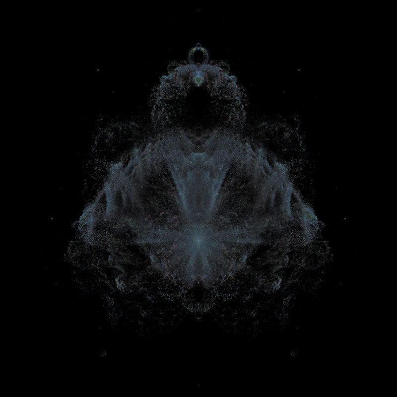

# Rostbrot

A toy implementation of the
[Buddhabrot](https://en.wikipedia.org/wiki/Buddhabrot),
with simplistic parallelization and lightly unoptimized to exclude the
central parts of the Mandelbrot set that do not escape.

Example output:

Detail showing some converging orbits:

